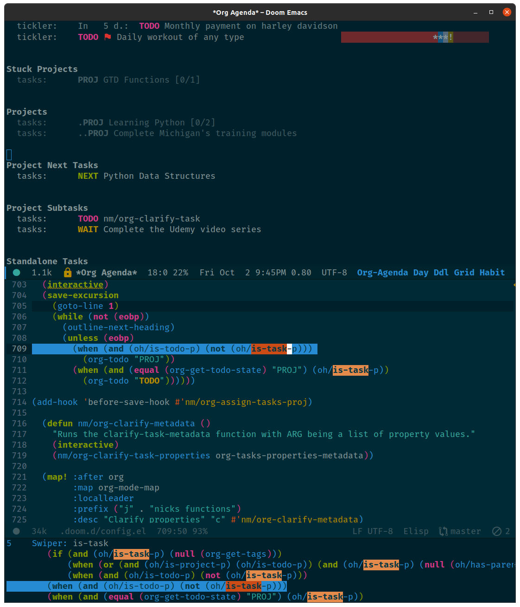
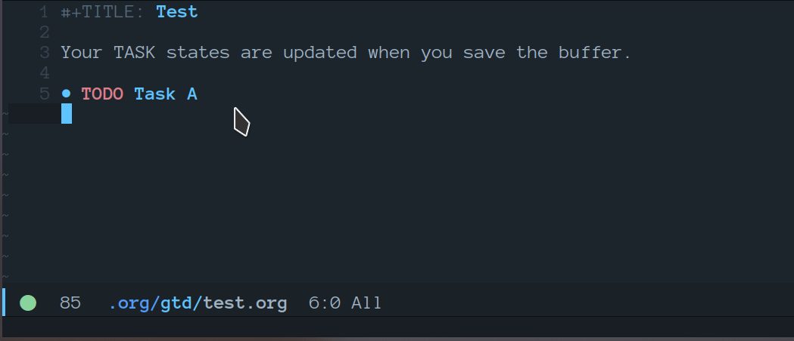
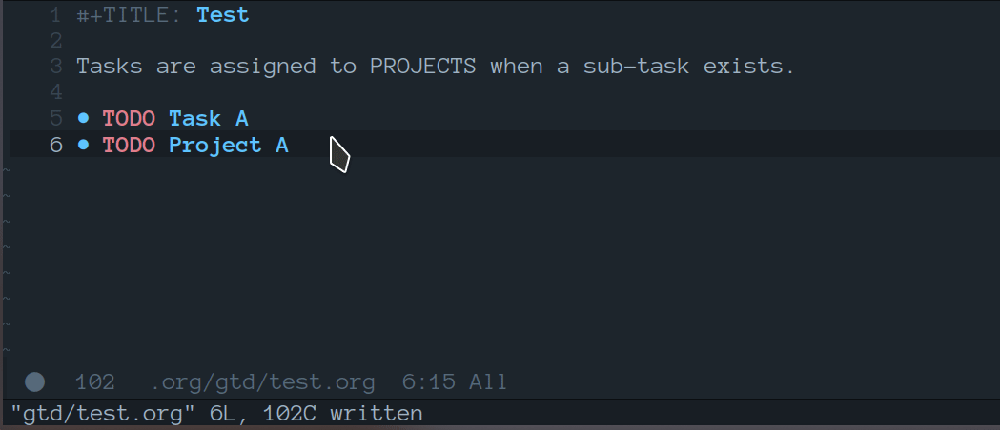
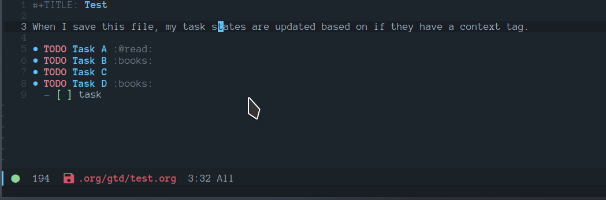

# Table of Contents

-   [New Changes](#org7f77572)
    -   [Clarify Tasks](#org9823ee2)
-   [Requirements](#org100ccbc)
-   [Default Settings](#orgbba5488)
-   [User Information](#org1a7e1bc)
-   [Misc Settings](#org2ca498a)
-   [Key Bindings](#orgd728b39)
-   [Terminal Mode](#org40e2882)
-   [Default folder(s) and file(s)](#orgcda2d61)
-   [Setup Layout by Monitor Profile](#org58b4944)
-   [Org mode settings](#orgb8be8ac)
    -   [Capture Templates](#org4067a1d)
-   [Directory settings](#orga3b4f15)
-   [Export Settings](#org1a82a6e)
-   [Misc Org Mode settings](#org8b3bd36)
-   [Keywords](#org0c0d79b)
-   [Logging and Drawers](#org3d61c7a)
-   [Properties](#orga53153c)
-   [Publishing](#org2ac1ce6)
-   [Refiling Defaults](#orga9d18cc)
-   [Orgmode Startup](#org9eaf37a)
-   [Default Tags](#org70490e5)
-   [Buffer Settings](#org96bb23a)
-   [Misc Settings](#orgf4d8fea)
-   [Module Settings](#org26ec02a)
    -   [company mode](#org8e17d74)
    -   [DEFT](#orged526e2)
    -   [Org-Rifle](#orga705aca)
    -   [ROAM](#org2c40217)
    -   [Pandoc](#org016666b)
    -   [Reveal [HTML Presentations]](#org269a72d)
    -   [Super Agenda Settings](#orgadff2f8)
-   [Loading secrets](#org7720ee9)
-   [Custom Functions](#org7264e1a)
    -   [Time Stamps](#org3476be8)
    -   [Capture Template File Picker](#org4c5254a)
    -   [Clarify Tasks](#orga114237)
    -   [Capture headline finder](#org34e9952)
    -   [Search file headlines and send tree to indirect buffer](#org707f94b)
    -   [Change Font](#org0dba21b)
-   [Theme Settings](#org1dc0bc1)

# New Changes

## Clarify Tasks

I got tired of manually setting task states to &ldquo;NEXT&rdquo; &ldquo;PROJ&rdquo; &ldquo;TODO&rdquo; so i&rsquo;ve added a few functions to automate these steps now&#x2026; Pictures are always more convincing, and even more so are GIFs.   

Assigning NEXT state if checkboxes exist:   
   

Creating PROJ tasks if subtasks exist:   
   

Assigning NEXT state if context tag exist: `:@read:`   
   

# Requirements

These are some items that are required outside of the normal DOOM EMACS installation, before you can use this config. The idea here is to keep this minimum so as much of this is close to regular DOOM EMACS.

1.  **SQLITE3 Installation**: You will need to install sqlite3, typicalled installed via your package manager as `sudo apt install sqlite3`
2.  For fonts please download [Input](https://input.fontbureau.com/download/), [DejaVu](http://sourceforge.net/projects/dejavu/files/dejavu/2.37/dejavu-fonts-ttf-2.37.tar.bz2) and [FiraCode](https://github.com/tonsky/FiraCode)

# Default Settings

In this section we are going to cover all the basics, and then tangle the results into `config.el`

# User Information

Environment settings, which are specific to the user and system. First up are user settings.

    (setq user-full-name "Nick Martin"
          user-mail-address "nmartin84@gmail.com")

# Misc Settings

Now we load some default settings for EMACS.

    (display-time-mode 1)
    (setq display-time-day-and-date t)

# Key Bindings

From here we load some extra key bindings that I use often

    (bind-key "<f6>" #'link-hint-copy-link)
    (map! :after org
          :map org-mode-map
          :leader
          :desc "Move up window" "<up>" #'evil-window-up
          :desc "Move down window" "<down>" #'evil-window-down
          :desc "Move left window" "<left>" #'evil-window-left
          :desc "Move right window" "<right>" #'evil-window-right
          :prefix ("s" . "+search")
          :desc "Outline" "o" #'counsel-outline
          :desc "Counsel ripgrep" "d" #'counsel-rg
          :desc "Swiper All" "@" #'swiper-all
          :desc "Rifle Buffer" "b" #'helm-org-rifle-current-buffer
          :desc "Rifle Agenda Files" "a" #'helm-org-rifle-agenda-files
          :desc "Rifle Project Files" "#" #'helm-org-rifle-project-files
          :desc "Rifle Other Project(s)" "$" #'helm-org-rifle-other-files
          :prefix ("l" . "+links")
          "o" #'org-open-at-point
          "g" #'eos/org-add-ids-to-headlines-in-file)
    
    (map! :after org-agenda
          :map org-agenda-mode-map
          :localleader
          :desc "Filter" "f" #'org-agenda-filter)

# Terminal Mode

Set a few settings if we detect terminal mode

    (when (equal (window-system) nil)
      (and
       (bind-key "C-<down>" #'+org/insert-item-below)
       (setq doom-theme 'doom-monokai-pro)
       (setq doom-font (font-spec :family "Input Mono" :size 20))))

# Default folder(s) and file(s)

Then we will define some default files. I&rsquo;m probably going to use default task files for inbox/someday/todo at some point so expect this to change. Also note, all customer functions will start with a `+` to distinguish from major symbols.

    (setq diary-file "~/.org/diary.org")
    (setq org-directory "~/.org/")

# Setup Layout by Monitor Profile

    (when (equal system-type 'gnu/linux)
      (setq doom-font (font-spec :family "Anonymous Pro" :size 18)
            doom-big-font (font-spec :family "Anonymous Pro" :size 26)))
    (when (equal system-type 'windows-nt)
      (setq doom-font (font-spec :family "IBM Plex Mono" :size 18)
            doom-big-font (font-spec :family "IBM Plex Mono" :size 22)))
    
    ; TODO Re-write new function for popup profile setup.
    (after! org (set-popup-rule! "^\\*lsp-help" :side 'bottom :size .30 :select t)
      (set-popup-rule! "*helm*" :side 'right :size .30 :select t)
      (set-popup-rule! "*Org QL View:*" :side 'right :size .25 :select t)
      (set-popup-rule! "*Capture*" :side 'left :size .30 :select t)
      (set-popup-rule! "*CAPTURE-*" :side 'left :size .30 :select t))
    ;  (set-popup-rule! "*Org Agenda*" :side 'right :size .35 :select t))

# Org mode settings

First I like to add some extra fancy stuff to make orgmode more appealing when i&rsquo;m using `+pretty` flag.

    (require 'org-habit)
    (after! org (setq org-hide-emphasis-markers t
                      org-hide-leading-stars t
                      org-list-demote-modify-bullet '(("+" . "-") ("1." . "a.") ("-" . "+"))))
    ;                  org-ellipsis "▼"))

-   Other options for ellipsis &ldquo;▼, ↴, ⬎, ⤷,…, and ⋱.&rdquo;
-   Extra options for headline-bullets-list: &ldquo;◉&rdquo; &ldquo;●&rdquo; &ldquo;○&rdquo; &ldquo;∴&rdquo;

Add a when condition that only adjust settings when certain features are enabled&#x2026; This depends on where i&rsquo;m running Emacs from (eg: Terminla, X11 or native).

    (when (require 'org-superstar nil 'noerror)
      (setq org-superstar-headline-bullets-list '("●" "○")
            org-superstar-item-bullet-alist nil))

Setting up my initial agenda settings

    (after! org (setq org-agenda-diary-file "~/.org/diary.org"
                      org-agenda-dim-blocked-tasks t
                      org-agenda-use-time-grid t
                      org-agenda-hide-tags-regexp "\\w+"
                      org-agenda-compact-blocks nil
                      org-agenda-block-separator ""
                      org-agenda-skip-scheduled-if-done t
                      org-agenda-skip-deadline-if-done t
                      org-agenda-window-setup 'current-window
                      org-enforce-todo-checkbox-dependencies nil
                      org-enforce-todo-dependencies t
                      org-habit-show-habits t))
    
    (after! org (setq org-agenda-files (append (file-expand-wildcards "~/.org/gtd/*.org"))))

Adjusting clock settings

    (after! org (setq org-clock-continuously t))

## Capture Templates

Here we setup the capture templates we want for `org-capture`. I use a file template that&rsquo;s pre-filled with my monthly scheduled transactions. (TODO: Add default file-template for new projects.)

    (after! org (setq org-capture-templates
          '(("!" "Quick Capture" plain (file+headline "~/.org/gtd/next.org" "Inbox")
             "* TODO %(read-string \"Task: \")\n:PROPERTIES:\n:CREATED: %U\n:END:")
            ("p" "New Project" plain (file nm/org-capture-file-picker)
             (file "~/.doom.d/templates/template-projects.org"))
            ("j" "Journal" entry (file "~/.org/journal.org")
             "* <%<%Y-%m-%d %H:%M %a>> %?" :clock-in t :clock-resume t)
            ("n" "Note on headline" plain (function nm/org-end-of-headline)
             "%?" :empty-lines-before 1 :empty-lines-after 1 :unnarrow t)
            ("f" "quick note to file" plain (function nm/org-capture-weeklies)
             "%?" :empty-lines-before 1 :empty-lines-after 1)
            ("$" "Scheduled Transactions" plain (file "~/.org/gtd/finances.ledger")
             (file "~/.doom.d/templates/ledger-scheduled.org"))
            ("l" "Ledger Transaction" plain (file "~/.org/gtd/finances.ledger")
             "%(format-time-string \"%Y/%m/%d\") * %^{transaction}\n Income:%^{From Account|Checking|Card|Cash}  -%^{dollar amount}\n Expenses:%^{category}  %\\3\n" :empty-lines-before 1))))

Example ledger template file: = `/.doom.d/templates/ledger-scheduled.org`

    %(format-time-string "%Y/%m")/24 * Transaction name
        Income:Checking                           -dollar amount
        Expenses:Insurance                         dollar amount

# Directory settings

TODO add function to set image-width to **80%** of the window size.

    (after! org (setq org-image-actual-width nil
                      org-archive-location "~/.org/gtd/archives.org::datetree"
                      projectile-project-search-path '("~/projects/")))

# Export Settings

    (after! org (setq org-html-head-include-scripts t
                      org-export-with-toc t
                      org-export-with-author t
                      org-export-headline-levels 4
                      org-export-with-drawers nil
                      org-export-with-email t
                      org-export-with-footnotes t
                      org-export-with-sub-superscripts nil
                      org-export-with-latex t
                      org-export-with-section-numbers nil
                      org-export-with-properties nil
                      org-export-with-smart-quotes t
                      org-export-backends '(pdf ascii html latex odt md pandoc)))

Embed images into the exported HTML files.

    (defun replace-in-string (what with in)
      (replace-regexp-in-string (regexp-quote what) with in nil 'literal))
    
    (defun org-html--format-image (source attributes info)
      (progn
        (setq source (replace-in-string "%20" " " source))
        (format ""
                (or (file-name-extension source) "")
                (base64-encode-string
                 (with-temp-buffer
                   (insert-file-contents-literally source)
                  (buffer-string)))
                (file-name-nondirectory source))))

# Misc Org Mode settings

    (require 'org-id)
    (setq org-link-file-path-type 'relative)

# Keywords

After much feedback and discussing with other users, I decided to simplify the keyword list to make it simple. Defining a project will now focus on the tag word **:project:** so that all child task are treated as part of the project.

<table border="2" cellspacing="0" cellpadding="6" rules="groups" frame="hsides">

<colgroup>
<col  class="org-left" />

<col  class="org-left" />
</colgroup>
<thead>
<tr>
<th scope="col" class="org-left">Keyword</th>
<th scope="col" class="org-left">Description</th>
</tr>
</thead>

<tbody>
<tr>
<td class="org-left">\TODO</td>
<td class="org-left">Task has actionable items defined and ready to be worked.</td>
</tr>

<tr>
<td class="org-left">HOLD</td>
<td class="org-left">Has actionable items, but is on hold due to various reasons.</td>
</tr>

<tr>
<td class="org-left">NEXT</td>
<td class="org-left">Is ready to be worked and should be worked on soon.</td>
</tr>

<tr>
<td class="org-left">DONE</td>
<td class="org-left">Task is completed and closed.</td>
</tr>

<tr>
<td class="org-left">KILL</td>
<td class="org-left">Abandoned or terminated.</td>
</tr>
</tbody>
</table>

    
    (custom-declare-face '+org-todo-active  '((t (:inherit (bold font-lock-constant-face org-todo)))) "")
    (custom-declare-face '+org-todo-project '((t (:inherit (bold font-lock-doc-face org-todo)))) "")
    (custom-declare-face '+org-todo-onhold  '((t (:inherit (bold warning org-todo)))) "")
    (custom-declare-face '+org-todo-next '((t (:inherit (bold font-lock-keyword-face org-todo)))) "")
    (custom-declare-face 'org-checkbox-statistics-todo '((t (:inherit (bold font-lock-constant-face org-todo)))) "")
    
      (setq org-todo-keywords
            '((sequence
               "TODO(t)"  ; A task that needs doing & is ready to do
               "PROJ(p)"  ; Project with multiple task items.
               "NEXT(n)"  ; Task is next to be worked on.
               "WAIT(w)"  ; Something external is holding up this task
               "|"
               "DONE(d)"  ; Task successfully completed
               "KILL(k)")) ; Task was cancelled, aborted or is no longer applicable
            org-todo-keyword-faces
            '(("WAIT" . +org-todo-onhold)
              ("PROJ" . +org-todo-project)
              ("TODO" . +org-todo-active)
              ("NEXT" . +org-todo-next)))

# Logging and Drawers

For the logging drawers, we like to keep our notes and clock history **seperate** from our properties drawer&#x2026;

    (after! org (setq org-log-state-notes-insert-after-drawers nil))

Next, we like to keep a history of our activity of a task so we **track** when changes occur, and we also keep our notes logged in **their own drawer**. Optionally you can also add the following in-buffer settings to override the `org-log-into-drawer` function. `#+STARTUP: logdrawer` or `#+STARTUP: nologdrawer`

    (after! org (setq org-log-into-drawer t
                      org-log-done 'time
                      org-log-repeat 'time
                      org-log-redeadline 'note
                      org-log-reschedule 'note))

# Properties

    (setq org-use-property-inheritance t ; We like to inhert properties from their parents
          org-catch-invisible-edits 'error) ; Catch invisible edits

# Publishing

REVIEW do we need to re-define our publish settings for the ROAM directory?

    (after! org (setq org-publish-project-alist
                      '(("attachments"
                         :base-directory "~/.org/"
                         :recursive t
                         :base-extension "jpg\\|jpeg\\|png\\|pdf\\|css"
                         :publishing-directory "~/publish_html"
                         :publishing-function org-publish-attachment)
                        ("notes-to-orgfiles"
                         :base-directory "~/.org/notes/"
                         :publishing-directory "~/notes/"
                         :base-extension "org"
                         :recursive t
                         :publishing-function org-org-publish-to-org)
                        ("notes"
                         :base-directory "~/.org/notes/"
                         :publishing-directory "~/nmartin84.github.io"
                         :section-numbers nil
                         :base-extension "org"
                         :with-properties nil
                         :with-drawers (not "LOGBOOK")
                         :with-timestamps active
                         :recursive t
                         :exclude "journal/.*"
                         :auto-sitemap t
                         :sitemap-filename "index.html"
                         :publishing-function org-html-publish-to-html
                         :html-head "<link rel=\"stylesheet\" href=\"https://raw.githack.com/nmartin84/raw-files/master/htmlpro.css\" type=\"text/css\"/>"
    ;                     :html-head "<link rel=\"stylesheet\" href=\"https://codepen.io/nmartin84/pen/RwPzMPe.css\" type=\"text/css\"/>"
    ;                     :html-head-extra ""
                         :html-link-up "../"
                         :with-email t
                         :html-link-up "../../index.html"
                         :auto-preamble t
                         :with-toc t)
                        ("myprojectweb" :components("attachments" "notes" "notes-to-orgfiles")))))

# Refiling Defaults

TODO tweak refiling settings to match new GTD setup

    (after! org (setq org-refile-targets '((nil :maxlevel . 9)
                                           (org-agenda-files :maxlevel . 4))
                      org-refile-use-outline-path 'buffer-name
                      org-outline-path-complete-in-steps nil
                      org-refile-allow-creating-parent-nodes 'confirm))

# Orgmode Startup

    (after! org (setq org-startup-indented 'indent
                      org-startup-folded 'content
                      org-src-tab-acts-natively t))
    (add-hook 'org-mode-hook 'org-indent-mode)
    (add-hook 'org-mode-hook 'auto-fill-mode)
    (add-hook 'org-mode-hook 'turn-off-auto-fill)

# Default Tags

REVIEW should we define any additional tags?

    (setq org-tags-column 0)
    (setq org-tag-alist '((:startgrouptag)
                          ("Context")
                          (:grouptags)
                          ("@home" . ?h)
                          ("@computer")
                          ("@work")
                          ("@place")
                          ("@bills")
                          ("@order")
                          ("@labor")
                          ("@read")
                          ("@brainstorm")
                          ("@planning")
                          (:endgrouptag)
                          (:startgrouptag)
                          ("Categories")
                          (:grouptags)
                          ("vehicles")
                          ("health")
                          ("house")
                          ("hobby")
                          ("coding")
                          ("material")
                          ("goal")
                          (:endgrouptag)
                          (:startgrouptag)
                          ("Section")
                          (:grouptags)
                          ("#coding")
                          ("#research")))

# Buffer Settings

    (global-auto-revert-mode 1)
    (setq undo-limit 80000000
          evil-want-fine-undo t
    ;      auto-save-default t
          inhibit-compacting-font-caches t)
    (whitespace-mode -1)
    
    (defun zyro/remove-lines ()
      "Remove lines mode."
      (display-line-numbers-mode -1))
    (remove-hook! '(org-roam-mode-hook) #'zyro/remove-lines)

# Misc Settings

    (setq display-line-numbers-type t)
    (setq-default
     delete-by-moving-to-trash t
     tab-width 4
     uniquify-buffer-name-style 'forward
     window-combination-resize t
     x-stretch-cursor t)

# Module Settings

## company mode

    (after! org
      (set-company-backend! 'org-mode 'company-capf '(company-yasnippet company-org-roam company-elisp))
      (setq company-idle-delay 0.25))

## DEFT

When this variable is set to `t` your deft directory will be updated to your projectile-project root&rsquo;s folder when switching projects, and the deft buffer&rsquo;s contents will be refreshed.

    (setq deft-use-projectile-projects t)
    (defun zyro/deft-update-directory ()
      "Updates deft directory to current projectile's project root folder and updates the deft buffer."
      (interactive)
      (if (projectile-project-p)
          (setq deft-directory (expand-file-name (doom-project-root)))))
    (when deft-use-projectile-projects
      (add-hook 'projectile-after-switch-project-hook 'zyro/deft-update-directory)
      (add-hook 'projectile-after-switch-project-hook 'deft-refresh))

Configuring DEFT default settings

    (load! "my-deft-title.el")
    (use-package deft
      :bind (("<f8>" . deft))
      :commands (deft deft-open-file deft-new-file-named)
      :config
      (setq deft-directory "~/.org/"
            deft-auto-save-interval 0
            deft-recursive t
            deft-current-sort-method 'title
            deft-extensions '("md" "txt" "org")
            deft-use-filter-string-for-filename t
            deft-use-filename-as-title nil
            deft-markdown-mode-title-level 1
            deft-file-naming-rules '((nospace . "-"))))
    
    (defun my-deft/strip-quotes (str)
      (cond ((string-match "\"\\(.+\\)\"" str) (match-string 1 str))
            ((string-match "'\\(.+\\)'" str) (match-string 1 str))
            (t str)))
    
    (defun my-deft/parse-title-from-front-matter-data (str)
      (if (string-match "^title: \\(.+\\)" str)
          (let* ((title-text (my-deft/strip-quotes (match-string 1 str)))
                 (is-draft (string-match "^draft: true" str)))
            (concat (if is-draft "[DRAFT] " "") title-text))))
    
    (defun my-deft/deft-file-relative-directory (filename)
      (file-name-directory (file-relative-name filename deft-directory)))
    
    (defun my-deft/title-prefix-from-file-name (filename)
      (let ((reldir (my-deft/deft-file-relative-directory filename)))
        (if reldir
            (concat (directory-file-name reldir) " > "))))
    
    (defun my-deft/parse-title-with-directory-prepended (orig &rest args)
      (let ((str (nth 1 args))
            (filename (car args)))
        (concat
          (my-deft/title-prefix-from-file-name filename)
          (let ((nondir (file-name-nondirectory filename)))
            (if (or (string-prefix-p "README" nondir)
                    (string-suffix-p ".txt" filename))
                nondir
              (if (string-prefix-p "---\n" str)
                  (my-deft/parse-title-from-front-matter-data
                   (car (split-string (substring str 4) "\n---\n")))
                (apply orig args)))))))
    (require 'my-deft-title)
    (advice-add 'deft-parse-title :around #'my-deft/parse-title-with-directory-prepended)

## Org-Rifle

    (use-package helm-org-rifle
      :after (helm org)
      :preface
      (autoload 'helm-org-rifle-wiki "helm-org-rifle")
      :config
      (add-to-list 'helm-org-rifle-actions '("Insert link" . helm-org-rifle--insert-link) t)
      (add-to-list 'helm-org-rifle-actions '("Store link" . helm-org-rifle--store-link) t)
      (defun helm-org-rifle--store-link (candidate &optional use-custom-id)
        "Store a link to CANDIDATE."
        (-let (((buffer . pos) candidate))
          (with-current-buffer buffer
            (org-with-wide-buffer
             (goto-char pos)
             (when (and use-custom-id
                        (not (org-entry-get nil "CUSTOM_ID")))
               (org-set-property "CUSTOM_ID"
                                 (read-string (format "Set CUSTOM_ID for %s: "
                                                      (substring-no-properties
                                                       (org-format-outline-path
                                                        (org-get-outline-path t nil))))
                                              (helm-org-rifle--make-default-custom-id
                                               (nth 4 (org-heading-components))))))
             (call-interactively 'org-store-link)))))
    
      ;; (defun helm-org-rifle--narrow (candidate)
      ;;   "Go-to and then Narrow Selection"
      ;;   (helm-org-rifle-show-entry candidate)
      ;;   (org-narrow-to-subtree))
    
      (defun helm-org-rifle--store-link-with-custom-id (candidate)
        "Store a link to CANDIDATE with a custom ID.."
        (helm-org-rifle--store-link candidate 'use-custom-id))
    
      (defun helm-org-rifle--insert-link (candidate &optional use-custom-id)
        "Insert a link to CANDIDATE."
        (unless (derived-mode-p 'org-mode)
          (user-error "Cannot insert a link into a non-org-mode"))
        (let ((orig-marker (point-marker)))
          (helm-org-rifle--store-link candidate use-custom-id)
          (-let (((dest label) (pop org-stored-links)))
            (org-goto-marker-or-bmk orig-marker)
            (org-insert-link nil dest label)
            (message "Inserted a link to %s" dest))))
    
      (defun helm-org-rifle--make-default-custom-id (title)
        (downcase (replace-regexp-in-string "[[:space:]]" "-" title)))
    
      (defun helm-org-rifle--insert-link-with-custom-id (candidate)
        "Insert a link to CANDIDATE with a custom ID."
        (helm-org-rifle--insert-link candidate t))
    
      (helm-org-rifle-define-command
       "wiki" ()
       "Search in \"~/lib/notes/writing\" and `plain-org-wiki-directory' or create a new wiki entry"
       :sources `(,(helm-build-sync-source "Exact wiki entry"
                     :candidates (plain-org-wiki-files)
                     :action #'plain-org-wiki-find-file)
                  ,@(--map (helm-org-rifle-get-source-for-file it) files)
                  ,(helm-build-dummy-source "Wiki entry"
                     :action #'plain-org-wiki-find-file))
       :let ((files (let ((directories (list "~/lib/notes/writing"
                                             plain-org-wiki-directory
                                             "~/lib/notes")))
                      (-flatten (--map (f-files it
                                                (lambda (file)
                                                  (s-matches? helm-org-rifle-directories-filename-regexp
                                                              (f-filename file))))
                                       directories))))
             (helm-candidate-separator " ")
             (helm-cleanup-hook (lambda ()
                                  ;; Close new buffers if enabled
                                  (when helm-org-rifle-close-unopened-file-buffers
                                    (if (= 0 helm-exit-status)
                                        ;; Candidate selected; close other new buffers
                                        (let ((candidate-source (helm-attr 'name (helm-get-current-source))))
                                          (dolist (source helm-sources)
                                            (unless (or (equal (helm-attr 'name source)
                                                               candidate-source)
                                                        (not (helm-attr 'new-buffer source)))
                                              (kill-buffer (helm-attr 'buffer source)))))
                                      ;; No candidates; close all new buffers
                                      (dolist (source helm-sources)
                                        (when (helm-attr 'new-buffer source)
                                          (kill-buffer (helm-attr 'buffer source))))))))))
      :general
      (:keymaps 'org-mode-map
       "M-s r" #'helm-org-rifle-current-buffer)
      :custom
      (helm-org-rifle-directories-recursive t)
      (helm-org-rifle-show-path t)
      (helm-org-rifle-test-against-path t))
    
    (provide 'setup-helm-org-rifle)

## ROAM

    (defun nm/remove-lines ()
      "Remove lines mode."
      (display-line-numbers-mode -1))
    (remove-hook! '(org-roam-mode-hook) #'nm/remove-lines)
    
    (setq org-roam-tag-sources '(prop last-directory))
    (setq org-roam-db-location "~/.org/roam.db")
    (setq org-roam-directory "~/.org/")
    
    (setq org-roam-dailies-capture-templates
       '(("d" "daily" plain (function org-roam-capture--get-point) ""
          :immediate-finish t
          :file-name "journal/%<%Y-%m-%d-%a>"
          :head "#+TITLE: %<%Y-%m-%d %a>\n#+STARTUP: content\n\n")))
    
    (setq org-roam-capture-templates
            '(("d" "digest" plain (function org-roam-capture--get-point)
               "%?"
               :file-name "notes/digest/%<%Y%m%d%H%M>-${slug}"
               :head "#+title: ${title}\n#+roam_tags: %^{roam_tags}\n\nsource :: [[%^{link}][%^{link_desc}]]\n\n"
               :unnarrowed t)
              ("n" "notes" plain (function org-roam-capture--get-point)
               :file-name "notes/${slug}"
               :head "#+title: ${title}\n#+roam_tags: %(read-string \"tags: \")\n\n"
               :unnarrowed t
               "%?")
              ("p" "private" plain (function org-roam-capture--get-point)
               :file-name "notes/private/${slug}"
               :head "#+title: ${title}\n#+roam_tags: %(read-string \"tags: \")\n\n"
               :unnarrowed t
               "%?")
              ("r" "reveal slide" plain (function org-roam-capture--get-point)
               :file-name "slides/%<%Y%m%d%H%M>-${slug}"
               :head "#+title: ${title}\n#+options: num:nil toc:nil\n#+REVEAL_THEME: %^{theme|black|white|league|beige|sky|night|serif|simple|solarized|blood|moon}\n#+REVEAL_PLUGINS: (highlight)\n#+REVEAL_OVERVIEW: t\n\n"
               :unnarrow t
               "%?")))

Export backlinks

    (defun my/org-roam--backlinks-list-with-content (file)
      (with-temp-buffer
        (if-let* ((backlinks (org-roam--get-backlinks file))
                  (grouped-backlinks (--group-by (nth 0 it) backlinks)))
            (progn
              (insert (format "\n\n* %d Backlinks\n"
                              (length backlinks)))
              (dolist (group grouped-backlinks)
                (let ((file-from (car group))
                      (bls (cdr group)))
                  (insert (format "** [[file:%s][%s]]\n"
                                  file-from
                                  (org-roam--get-title-or-slug file-from)))
                  (dolist (backlink bls)
                    (pcase-let ((`(,file-from _ ,props) backlink))
                      (insert (s-trim (s-replace "\n" " " (plist-get props :content))))
                      (insert "\n\n")))))))
        (buffer-string)))
    
    (defun my/org-export-preprocessor (backend)
      (let ((links (my/org-roam--backlinks-list-with-content (buffer-file-name))))
        (unless (string= links "")
          (save-excursion
            (goto-char (point-max))
            (insert (concat "\n* Backlinks\n") links)))))
    
    (add-hook 'org-export-before-processing-hook 'my/org-export-preprocessor)

## Pandoc

    (setq org-pandoc-options '((standalone . t) (self-contained . t)))

## Reveal [HTML Presentations]

    (require 'ox-reveal)
    (setq org-reveal-root "https://cdn.jsdelivr.net/npm/reveal.js")
    (setq org-reveal-title-slide nil)

## Super Agenda Settings

    (setq org-agenda-custom-commands
          (quote (("N" "Notes" tags "NOTE"
                   ((org-agenda-overriding-header "Notes")
                    (org-tags-match-list-sublevels t)))
                  ("h" "Habits" tags-todo "STYLE=\"habit\""
                   ((org-agenda-overriding-header "Habits")
                    (org-agenda-sorting-strategy
                     '(todo-state-down effort-up category-keep))))
                  ("i" "Inbox"
                   ((tags "REFILE"
                          ((org-agenda-overriding-header "Tasks to Refile")
                           (org-tags-match-list-sublevels nil)))))
                  ("w" "Master Agenda"
                   ((agenda ""
                            ((org-agenda-span '1)
                             (org-agenda-files (append (file-expand-wildcards "~/.org/gtd/*.org")))
                             (org-agenda-start-day (org-today))))
                    (tags-todo "-CANCELLED/!"
                               ((org-agenda-overriding-header "Stuck Projects")
                                (org-agenda-skip-function 'bh/skip-non-stuck-projects)
                                (org-agenda-sorting-strategy
                                 '(category-keep))))
                    (tags-todo "-HOLD-CANCELLED/!"
                               ((org-agenda-overriding-header "Projects")
                                (org-agenda-skip-function 'bh/skip-non-projects)
                                (org-tags-match-list-sublevels 'indented)
                                (org-agenda-sorting-strategy
                                 '(category-keep))))
                    (tags-todo "-CANCELLED/!NEXT"
                               ((org-agenda-overriding-header (concat "Project Next Tasks"
                                                                      (if bh/hide-scheduled-and-waiting-next-tasks
                                                                          ""
                                                                        " (including WAITING and SCHEDULED tasks)")))
                                (org-agenda-skip-function 'bh/skip-projects-and-habits-and-single-tasks)
                                (org-tags-match-list-sublevels t)
                                (org-agenda-todo-ignore-scheduled bh/hide-scheduled-and-waiting-next-tasks)
                                (org-agenda-todo-ignore-deadlines bh/hide-scheduled-and-waiting-next-tasks)
                                (org-agenda-todo-ignore-with-date bh/hide-scheduled-and-waiting-next-tasks)
                                (org-agenda-sorting-strategy
                                 '(todo-state-down effort-up category-keep))))
                    (tags-todo "-SOMEDAY-REFILE-CANCELLED-WAITING-HOLD/!"
                               ((org-agenda-overriding-header (concat "Project Subtasks"
                                                                      (if bh/hide-scheduled-and-waiting-next-tasks
                                                                          ""
                                                                        " (including WAITING and SCHEDULED tasks)")))
                                (org-agenda-skip-function 'bh/skip-non-project-tasks)
                                (org-agenda-todo-ignore-scheduled bh/hide-scheduled-and-waiting-next-tasks)
                                (org-agenda-todo-ignore-deadlines bh/hide-scheduled-and-waiting-next-tasks)
                                (org-agenda-todo-ignore-with-date bh/hide-scheduled-and-waiting-next-tasks)
                                (org-agenda-sorting-strategy
                                 '(category-keep))))
                    (tags-todo "-SOMEDAY-REFILE-CANCELLED-#waiting-#hold-#monitor/!"
                               ((org-agenda-overriding-header (concat "Standalone Tasks"
                                                                      (if bh/hide-scheduled-and-waiting-next-tasks
                                                                          ""
                                                                        " (including WAITING and SCHEDULED tasks)")))
                                (org-agenda-skip-function 'bh/skip-project-tasks)
                                (org-agenda-todo-ignore-scheduled t)
                                (org-agenda-todo-ignore-deadlines t)
                                (org-agenda-todo-ignore-with-date t)
                                (org-agenda-sorting-strategy
                                 '(category-keep))))
                    (tags-todo "-CANCELLED+#waiting|#hold|#monitor/"
                               ((org-agenda-overriding-header (concat "Waiting and Postponed Tasks"
                                                                      (if bh/hide-scheduled-and-waiting-next-tasks
                                                                          ""
                                                                        " (including WAITING and SCHEDULED tasks)")))
                                (org-agenda-skip-function 'bh/skip-non-tasks)
                                (org-tags-match-list-sublevels nil)
                                (org-agenda-todo-ignore-scheduled bh/hide-scheduled-and-waiting-next-tasks)
                                (org-agenda-todo-ignore-deadlines bh/hide-scheduled-and-waiting-next-tasks)))
                    (tags "-REFILE/"
                          ((org-agenda-overriding-header "Tasks to Archive")
                           (org-agenda-skip-function 'bh/skip-non-archivable-tasks)
                           (org-tags-match-list-sublevels nil))))
                   nil))))

# Loading secrets

    (let ((secrets (expand-file-name "secrets.el" doom-private-dir)))
    (when (file-exists-p secrets)
      (load secrets)))

# Custom Functions

    (load! "customs.el")
    (load! "org-helpers.el")

## Time Stamps

    (defun nm/org-insert-timestamp ()
      "Insert active timestamp at POS."
      (interactive)
      (insert (format "<%s> " (format-time-string "%Y-%m-%d %H:%M:%p"))))
    (map! :after org
          :map org-mode-map
          :localleader
          :prefix ("j" . "nicks functions")
          :desc "Insert timestamp at POS" "i" #'nm/org-insert-timestamp)

## Capture Template File Picker

    (defun nm/org-capture-file-picker ()
      "Select a file from the PROJECTS folder and return file-name."
      (let ((file (read-file-name "Project: " "~/.org/gtd/projects/")))
        (expand-file-name (format "%s" file))))

## Clarify Tasks

Clarify task will take a list of property fields and pass them to `nm/org-clarify-task-properties` to update task items which are missing those property fields.

    (defun nm/org-get-headline-property (arg)
      "Extract property from headline and return results."
      (interactive)
      (org-entry-get nil arg t))
    
    (defun nm/org-get-headline-properties ()
      "Get headline properties for ARG."
      (org-back-to-heading)
      (org-element-at-point))
    
    (defun nm/org-get-headline-title ()
      "Get headline title from current headline."
      (interactive)
      (org-element-property :title (nm/org-get-headline-properties)))
    
    ;;;;;;;;;;;;--------[ Clarify Task Properties ]----------;;;;;;;;;;;;;
    
    (defun nm/update-task-tags ()
      "Update all child tasks in buffer that are missing a TAG value."
      (interactive)
      (org-show-all)
      (while (not (eobp))
        (progn
          (outline-next-heading)
          (org-narrow-to-subtree)
          (unless (eobp)
            (if (and (oh/is-task-p) (null (org-get-tags)))
                (counsel-org-tag)))
          (widen))))
    
    (setq org-tasks-properties-metadata (list "SOURCE"))
    
    (defun nm/org-clarify-task-properties (arg)
      "Update the metadata for a task headline."
      (unless (equal major-mode 'org-mode)
        (error "Not visiting an org-mode buffer."))
      (save-restriction
        (save-excursion
          (org-show-all)
          (goto-char (point-min))
          (let ((props arg))
            (while (not (eobp))
              (outline-next-heading)
              (org-narrow-to-subtree)
              (unless (eobp)
                (when (or (and (oh/is-project-p) (oh/is-todo-p)) (and (oh/is-task-p) (null (oh/has-parent-project-p)) (null (oh/has-subtask-p))))
                  (mapcar (lambda (props)
                            (when (null (org-entry-get nil (upcase props) t))
                              (org-set-property (upcase props) (org-read-property-value (upcase props))))) props))
                (when (and (oh/is-todo-p) (not (oh/is-task-p)))
                  (org-todo "PROJ"))
                (widen)))))))
    
    (defun nm/update-task-states ()
      "Scans buffer and assigns all tasks that contain child-tasks the PROJ keyword and vice versa."
      (interactive)
      (save-excursion
        (goto-line 1)
        (while (not (eobp))
          (outline-next-heading)
          (unless (eobp)
            (nm/org-update-projects)
            (nm/org-set-next-state)))))
    
    (defun nm/org-update-projects ()
      "If task is project then assign to PROJ keyword."
      (when (or (and (nm/has-subtask-active-p) (oh/is-todo-p)) (and (oh/is-todo-p) (nm/has-subtask-done-p) (nm/has-subtask-active-p)))
        (org-todo "PROJ")))
    ;  (when (or (and (not (nm/org-checkbox-exist-p)) (equal (org-get-todo-state) "PROJ") (oh/is-task-p))
    ;            (and (not (nm/org-checkbox-exist-p)) (oh/is-task-p) (not (equal (org-get-todo-state) "DONE"))))
    ;    (org-todo "TODO")))
    
    (defun nm/org-set-next-state ()
      "If task contains checkbox  that's not DONE then set task state to NEXT."
      (interactive)
      (save-excursion
        (org-back-to-heading)
        (when (save-excursion (and (bh/is-task-p) (or (and (nm/exist-context-tag-p) (not (equal (org-get-todo-state) "DONE"))) (and (nm/checkbox-active-exist-p) (nm/checkbox-done-exist-p)) (nm/checkbox-active-exist-p))))
          (org-todo "NEXT"))
        (when (and (not (equal (org-get-todo-state) "DONE")) (null (nm/exist-context-tag-p)) (bh/is-task-p) (not (nm/checkbox-done-exist-p)) (not (nm/checkbox-active-exist-p)))
          (org-todo "TODO"))
        (when (and (bh/is-task-p) (not (nm/checkbox-active-exist-p)) (nm/checkbox-done-exist-p))
          (org-todo "DONE"))))
    
    (defun nm/checkbox-active-exist-p ()
      "Checks if a checkbox that's not marked DONE exist in the tree."
      (interactive)
      (org-back-to-heading)
      (let ((end (save-excursion (org-end-of-subtree t))))
        (search-forward-regexp "^[-+] \\[\\W].+\\|^[1-9].\\W\\[\\W]" end t)))
    
    (defun nm/checkbox-done-exist-p ()
      "Checks if a checkbox that's not marked DONE exist in the tree."
      (interactive)
      (org-back-to-heading)
      (let ((end (save-excursion (org-end-of-subtree t))))
        (search-forward-regexp "^[-+] \\[X].+\\|^[1-9].\\W\\[X]" end t)))
    
    (defun nm/has-subtask-done-p ()
      "Returns t for any heading that has a subtask is DONE state."
      (interactive)
      (org-back-to-heading t)
      (let ((end (save-excursion (org-end-of-subtree t))))
        (outline-end-of-heading)
        (save-excursion
          (re-search-forward (concat "^\*+ " "\\(DONE\\|KILL\\)") nil end))))
    
    (defun nm/has-subtask-active-p ()
      "Returns t for any heading that has subtasks."
      (save-restriction
        (widen)
        (org-back-to-heading t)
        (let ((end (save-excursion (org-end-of-subtree t))))
          (outline-end-of-heading)
          (save-excursion
            (re-search-forward (concat "^\*+ " "\\(NEXT\\|WAIT\\|TODO\\)") end t)))))
    
    (defun nm/exist-tag-p (arg)
      "If headline has ARG tag keyword assigned, return t."
      (interactive)
      (let ((end (save-excursion (end-of-line))))
        (save-excursion
          (progn
            (unless (org-at-heading-p)
              (org-back-to-heading t))
            (beginning-of-line)
            (re-search-forward (format ":%s:" arg) end t)))))
    
    (defconst nm/context-tags " *:[@\\w+:]")
    
    (defun nm/exist-context-tag-p (&optional arg)
      "If headline has context tag keyword assigned, return t."
      (interactive)
      (goto-char (org-entry-beginning-position))
      (let ((end (save-excursion (line-end-position))))
        (re-search-forward nm/context-tags end t)))
    
    (add-hook 'before-save-hook #'nm/update-task-states)
    
    (defun nm/org-clarify-metadata ()
      "Runs the clarify-task-metadata function with ARG being a list of property values."
      (interactive)
      (nm/org-clarify-task-properties org-tasks-properties-metadata))
    
    (map! :after org
          :map org-mode-map
          :localleader
          :prefix ("j" . "nicks functions")
          :desc "Clarify properties" "c" #'nm/org-clarify-metadata)

## Capture headline finder

    (defun nm/org-capture-system ()
      "Capture stuff."
      (interactive)
      (save-restriction
        (let ((org-capture-templates
               '(("h" "headline capture" entry (function counsel-outline)
                  "* %?" :empty-lines-before 1 :empty-lines-after 1)
                 ("p" "plain capture" plain (function end-of-buffer)
                  "<%<%Y-%m-%d %H:%M>> %?" :empty-lines-before 1 :empty-lines-after 1))))
          (find-file-other-window (read-file-name "file: " "~/.org/"))
          (if (counsel-outline-candidates)
              (org-capture nil "h"))
          (org-capture nil "p"))))
    
    (defun nm/org-capture-to-file ()
      "Capture stuff."
      (interactive)
      (save-restriction
        (let ((org-capture-templates
               '(("h" "headline capture" entry (function counsel-outline)
                  "* %?" :empty-lines-before 1 :empty-lines-after 1)
                 ("p" "plain capture" plain (function end-of-buffer)
                  "<%<%Y-%m-%d %H:%M>> %?" :empty-lines-before 1 :empty-lines-after 1))))
          (org-capture nil "h"))))
    
    (bind-key "<f7>" #'nm/org-capture-to-file)
    
    (defun nm/org-capture-weeklies ()
      "Find weeklies file and call counsel-outline."
      (interactive)
      (find-file (read-file-name "file: " "~/.org/"))
      (progn
        (counsel-outline)
        (nm/org-end-of-headline)))
    
    (defun nm/org-end-of-headline()
      "Move to end of current headline"
      (interactive)
      (outline-next-heading)
      (forward-char -1))

## Search file headlines and send tree to indirect buffer

    ; TODO Write function that takes a file as input from user, then returns a searchable headline list and narrows the results to a indirect buffer.

## Change Font

    (defun nm/emacs-change-font ()
      "Change font based on available font list."
      (interactive)
      (let ((font (ivy-completing-read "font: " (font-family-list))))
        (setq doom-font (font-spec :family font :size 18)
              doom-big-font (font-spec :family font :size 24)))
      (doom/reload-font))

# Theme Settings

    ;(after! org (toggle-frame-maximized)
    (defun nm/adjust-frame-size ()
      "set frame size accordingly."
      (set-frame-size (selected-frame) 130 65))

